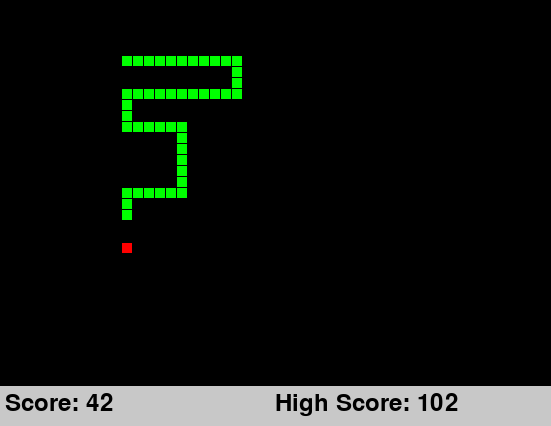

# Snake
A classic game of snake implemented with OOP. To play run [App.py](./App.py).

Eat as many pieces of red food before you either run into the edge of the screen or hit yourself. Use the arrow keys to change direction. Hit the escape key to exit. Pause by hitting the spacebar and unpause by hitting any other key.

# Simple AI

# A* Pathfinding AI