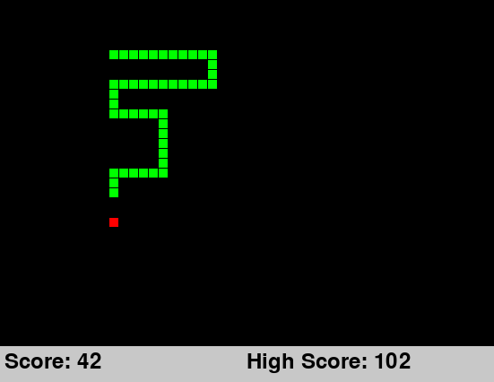

# Snake
A classic game of snake implemented with OOP. Three artificial intelligences have been designed to play the game as well; a simple heuristic approach, an A* pathfinding approach, and a machine learning model using NEAT (still to come). See below for more information on each of these.

To play or see an AI play run [App.py](./App.py) and comment out which version you would like to run at the bottom of the file.

Eat as many pieces of red food before you either run into the edge of the screen or hit yourself. Use the arrow keys to change direction. Hit the escape key to exit. Pause by hitting the spacebar and unpause by hitting any other key.

# Simple AI

# A* Pathfinding AI

# NEAT AI